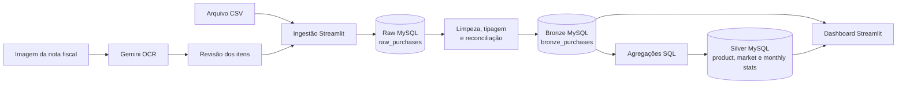

# Shopping List Intelligence

Uma aplicação Streamlit para transformar notas fiscais e arquivos CSV em um
histórico estruturado de compras, indicadores de preço e sugestões de reposição.

O projeto combina OCR com Google Gemini, um pipeline de dados em arquitetura
medalhão e um dashboard interativo. Os dados passam por camadas Raw, Bronze e
Silver em bancos MySQL separados antes de alimentar as análises.

## O que o projeto entrega

- **Captura assistida:** extração dos itens de notas fiscais por imagem com o
  Gemini e revisão dos campos antes da gravação.
- **Importação estruturada:** entrada alternativa por CSV, com suporte a
  quantidade, preço unitário, total da linha e metadados de NFC-e.
- **Pipeline medalhão:** preservação do dado recebido na Raw, normalização na
  Bronze e agregações analíticas na Silver.
- **Lista inteligente:** indicação de produtos que provavelmente precisam ser
  comprados com base no intervalo histórico de reposição.
- **Análises de consumo:** evolução de preços, comparação entre mercados,
  gastos mensais e curva de recorrência.
- **Correção manual:** inclusão, alteração e exclusão de registros já
  processados, com atualização das tabelas analíticas.

## Arquitetura e fluxo do projeto



### Fluxo em seis etapas

1. **Entrada:** o usuário envia uma imagem de nota fiscal ou um arquivo CSV.
2. **Extração:** imagens são processadas pelo Gemini; a resposta JSON é
   convertida em uma tabela editável.
3. **Raw:** os registros revisados são gravados como strings em
   `raw_purchases`, preservando a entrada original.
4. **Bronze:** datas e valores são tipados, nomes são normalizados e quantidade,
   preço unitário e total da linha são reconciliados.
5. **Silver:** consultas SQL recalculam estatísticas por produto, mercado e mês.
6. **Consumo:** o Streamlit combina Bronze e Silver para montar listas,
   indicadores, gráficos e editores.

## Camadas de dados

Cada camada reside em um database MySQL independente no mesmo servidor.

| Camada | Tabela | Responsabilidade |
|---|---|---|
| Raw | `raw_purchases` | Preservar os registros recebidos e sua origem de ingestão |
| Bronze | `bronze_purchases` | Limpar, tipar e normalizar cada item comprado |
| Silver | `silver_product_stats` | Calcular frequência e estatísticas de preço por produto |
| Silver | `silver_market_stats` | Consolidar gasto, ticket médio e visitas por mercado |
| Silver | `silver_monthly_spending` | Consolidar gasto, itens e preço médio por mês |

O processamento Raw → Bronze é incremental por `raw_id`. As tabelas Silver são
recalculadas integralmente a partir da Bronze após cada alteração.

## Produto analítico

| Página | Pergunta respondida |
|---|---|
| **Lista de Compras** | Quais produtos já ultrapassaram o intervalo médio de recompra? |
| **Análise de Preços** | Como o preço de cada produto evoluiu e quais aumentos merecem atenção? |
| **Mercados** | Onde ocorrem mais compras e como gasto e ticket médio se comparam? |
| **Tendências** | Como gastos, itens e recorrência mudam ao longo do tempo? |
| **Importar Dados** | Como adicionar uma nota por OCR ou carregar um CSV? |
| **Editar Dados** | Como corrigir, adicionar ou remover registros processados? |

### Regras importantes

- `product_price` representa o total efetivamente pago na linha.
- `quantity` usa `1` quando não é informada ou é inválida.
- `unit_price` pode ser derivado de `product_price / quantity` e o total pode
  ser derivado de `quantity * unit_price` quando apenas esses dois valores são
  fornecidos.
- `access_key` e `nfce_url` são metadados opcionais da NFC-e e não participam
  das agregações financeiras.
- A indicação de compra compara os dias desde a última compra com o intervalo
  médio histórico do produto; ela é uma heurística, não uma previsão de demanda.

## Tecnologias

| Responsabilidade | Tecnologias |
|---|---|
| Interface e visualização | Streamlit, Altair |
| Processamento | Python, Pandas, NumPy |
| OCR de notas fiscais | Google Gemini |
| Persistência | MySQL, SQLAlchemy, PyMySQL |
| Ambiente | uv, Docker, Docker Compose |
| Qualidade de código | Ruff |

## Execução local

### Pré-requisitos

- Python 3.13 ou superior;
- [`uv`](https://docs.astral.sh/uv/);
- um servidor MySQL acessível;
- uma chave da API Gemini para usar o fluxo de OCR;
- Docker com Docker Compose, caso prefira executar em container.

### Configuração

Crie o arquivo local de ambiente a partir do exemplo e preencha as credenciais:

```bash
cp .env.example .env
```

| Variável | Finalidade |
|---|---|
| `MYSQL_HOST` | Host do servidor MySQL |
| `MYSQL_PORT` | Porta do MySQL; o padrão é `3306` |
| `MYSQL_USER` | Usuário usado pela aplicação |
| `MYSQL_PASSWORD` | Senha do usuário MySQL |
| `GEMINI_API_KEY` | Chave usada somente na extração por imagem |

Na primeira inicialização, a aplicação cria os databases `raw`, `bronze` e
`silver`, cria as tabelas necessárias e aplica as migrações aditivas conhecidas.
O usuário MySQL precisa ter permissão para criar esses databases.

### Executar com uv

```bash
uv sync --frozen
uv run streamlit run main.py
```

A interface estará disponível em <http://localhost:8501>.

### Executar com Docker

```bash
docker compose up --build
```

O Compose publica o Streamlit em <http://localhost:8502>. O MySQL não é
provisionado pelo Compose e deve estar acessível a partir do container pelo host
informado em `MYSQL_HOST`.

## Importação por CSV

As colunas obrigatórias são `purchase_date`, `product_id`, `market_id` e
`product_price`; alternativamente, o total pode ser calculado quando
`quantity` e `unit_price` são fornecidos. `access_key` e `nfce_url` são
opcionais.

```csv
purchase_date,product_id,quantity,unit_price,product_price,market_id
2026-01-15,Arroz,2,8.50,17.00,Mercado Exemplo
2026-01-15,Leite,3,5.20,15.60,Mercado Exemplo
```

Datas devem usar o formato ISO `YYYY-MM-DD` e números decimais devem usar ponto.
O exemplo acima é totalmente fictício; arquivos reais de compras não são
versionados pelo projeto.

## Estrutura do repositório

```text
personal-shopping-list/
├── main.py                  # aplicação e dashboard Streamlit
├── src/
│   ├── database.py          # conexões, criação e evolução dos databases
│   ├── etl.py               # pipeline Raw → Bronze → Silver
│   ├── gemini.py            # integração de OCR com o Gemini
│   ├── models.py            # modelos SQLAlchemy
│   └── query/               # agregações SQL da camada Silver
├── template/
│   ├── prompt.md            # regras de extração da nota fiscal
│   └── response.json        # formato esperado da resposta do OCR
├── .env.example
├── Dockerfile
├── docker-compose.yml
└── pyproject.toml
```

## Qualidade

```bash
uv run --frozen ruff check .
uv run --frozen ruff format --check .
docker compose config
```

O repositório ainda não possui uma suíte automatizada de testes. As verificações
atuais cobrem lint, formatação e validade da configuração do Compose.

## Privacidade e limitações

- Notas fiscais, imagens, arquivos CSV de compras, `.env` e credenciais devem
  permanecer apenas no ambiente local.
- A qualidade do OCR depende da legibilidade da imagem; todos os campos devem
  ser revisados antes da importação.
- O pipeline pressupõe um único servidor MySQL capaz de hospedar os três
  databases.
- O processamento Silver é um refresh completo e ainda não possui orquestração
  ou observabilidade externas.
- O projeto é uma ferramenta pessoal de análise e não substitui controles
  financeiros ou fiscais.
